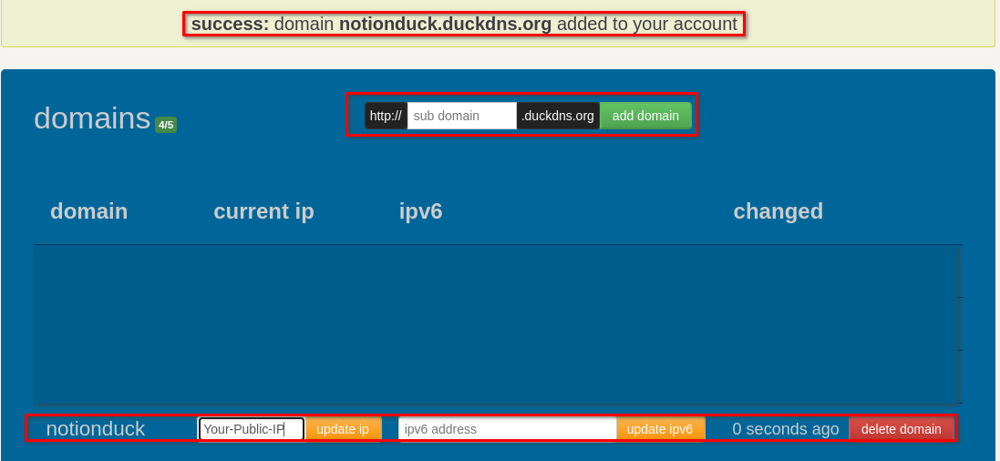

# Encriptación HTTPS con Duckdns

## Inspiración

Si es que has leído los anteriores artículos, te podrás dar cuenta que monte un servidor en casa, por lo que uno de los problemas que enfrente al momento de montar los servicios que quería, es que todos ellos utilizaban el trafico http en lugar de https, a simple vista no parece un gran problema pero la realidad es que eso implica que todos los datos estan viajando sin cifrar y eso es muy preocupante, entonces despues de conseguir un DNS con DuckDNS, tuve que investigar como crear certificados SSL y este articulo es el resultado de esta investigación.

## Objetivo

Aprender como crear certificados SSL totalmente gratis y de forma sencilla para todos los servicios que quieras utilizar. Este articulo es el resultado de una larga investigacion sobre la creacion de certificados SSL resumido en unos sencillos pasos.  

## Requisitos

- DNS de DuckDNS
- Poder abrir puertos con tu proveedor de internet
- Servidor local
- Nginx Proxy Manager
- Docker compose

## Recursos

- https://nginxproxymanager.com/
- [https://docs.docker.com/engine/install/debian/](https://docs.docker.com/engine/install/debian/)
- [https://www.duckdns.org/spec.jsp](https://www.duckdns.org/spec.jsp)
- https://nordvpn.com/es-mx/what-is-my-ip/
- [https://es.simbase.com/learning/private-and-public-ip-addresses](https://es.simbase.com/learning/private-and-public-ip-addresses#:~:text=Una%20direcci%C3%B3n%20IP%20privada%20se,informaci%C3%B3n%20que%20buscas%20pueda%20encontrarte)
- [https://hub.docker.com/r/linuxserver/duckdns](https://hub.docker.com/r/linuxserver/duckdns)

## Tutorial

1. Crear un DNS con DuckDNS, este debe de estar apuntando a nuestra direccion IP publica, si cuentas con una IP dinamica, puedes utilizar el docker de DuckDNS para mantener actualizado la IP.
    
    
    

1. Abrimos el Nginx Proxy Manager con http:<IP:81>, este es un docker y la primera vez que lo utilizamos el usuario y contraseña predeterminada es:
    
    ```
    Email:    admin@example.com
    Password: changeme
    ```
    
    
    
    Nos va a pedir que pongamos un perfil y que cambiemos la contraseña predeterminada, por lo cual se recomienda mucho. Despues de esa configuración, el dashboard principal es este:
    
    
    
2. Ahora vamos al apartado de Proxy Hosts, y vamos a configurar un proxy inverso para que un host nuestro se relacione con un dominio.
    1. Configuración de dominio y direccion IP: En este caso vamos a poner el DNS que creamos en DuckDNS y ponemos la direccion IP local del host que queremos vincular con el dominio y seleccionamos el puerto del servicio, en este ejemplo le estamos poniendo un dominio al propio servicio de Nginx Proxy Manager que corre en el puerto 81
        
        
        
    2. Despues nos vamos al apartado de SSL y en este caso es muy importante ya haber abierto el puerto 80 (web), 81 (el puerto por el cual corre Nginx Proxy Manager) y el puerto 443 (El que se utiliza para certificados SSL)
    3. En el apartado SSL seleccionamos solicitar un nuevo SSL a Let’s Encrypt  y utilizar un DNS challenge
        
        
        
    4. Seleccionamos el servicio de DuckDNS y ponemos nuestro token de DuckDNS donde dice **your-duckdns-token** y por ultimo un correo el cual nos va a servir para avisarnos de cuando va a vencer nuestro certificado para poder renovarlo antes.
        
        
        
    5. Guardamos nuestra configuración y si todo sale bien debe de aparecer asi:
        
        Tal vez tarde un poco verse en reflado la pagina pero si todo sale bien puedes entrar visitar la pagina con https://yourdns.duckdns.org
        
        
        
3. Visitamos la pagina con nuestro DNS de DuckDNS
    
    
    
4. Podemos repetir este proceso las veces que sean necesarias para asiganarle un centificado SSL a los servicios que estemos utilizando.
